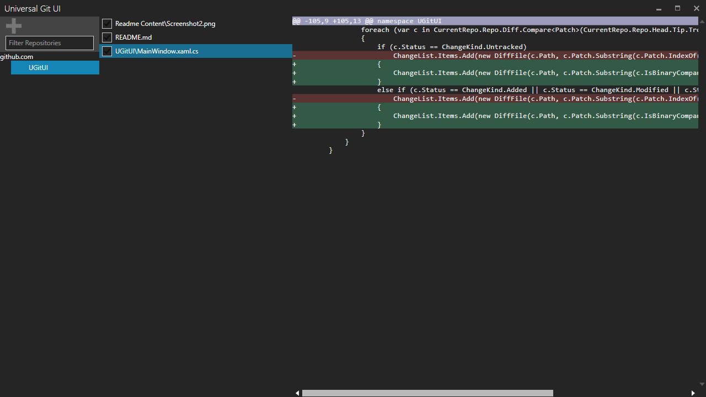
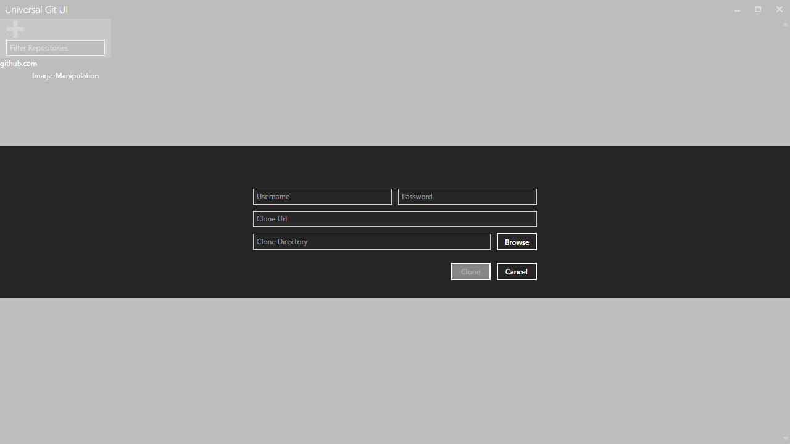

# UGitUI
An alternative user interface for managing your git repositories.

#Features
* Add pre-cloned repositories through drag-drop.
* Categorization of repositories by base repository domain name

#Add Repository

